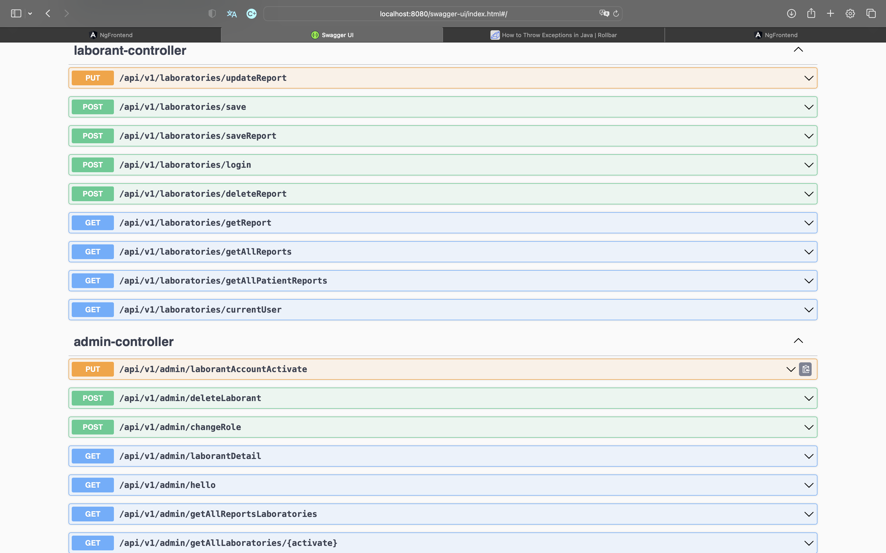
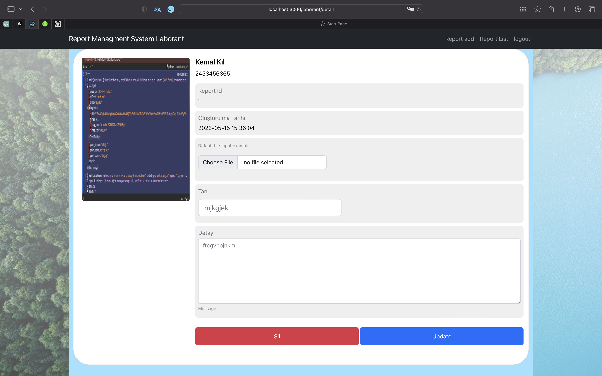
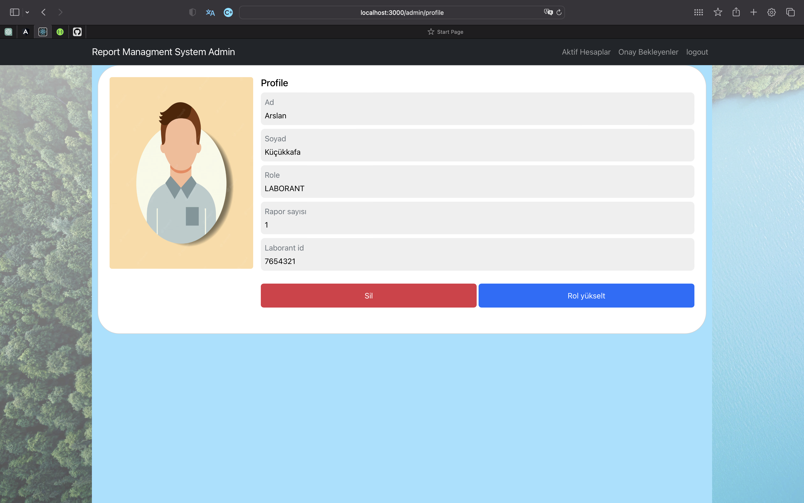

# Laborant Report Managment System

This application has two diffrent role. One user has a just one role.
Default role is LABORANT. Admin give just only ADMIN role.
Laborant can report add, delete,update and list in this application. 
Admin can confirm account, delete account,list account, get detail account in this application.

Also I have a initial data. İnitial data adding Role and one Admin.
initial data path backend/src/main/resources/data.sql .
Admin name:Arslan,surname:Küçükkafa,laborant_id:87654321,password:Arslan19@ .
You can use this informations when to build apllication.

## Using
Enter the folder if you are installed repository git clone or other ways 

```bash
docker-compose up
```
### [swagger](localhost:8080/swagger-ui/index.html)


 
### [register](http://localhost:3000/register)

You must waited when util confirm account if you are registered


### Login
You can login if you are confirmed account . try


## LABORANT ROLE
1. 
2. 
3. 


## ADMIN ROLE
1. 
2. 
3. 


